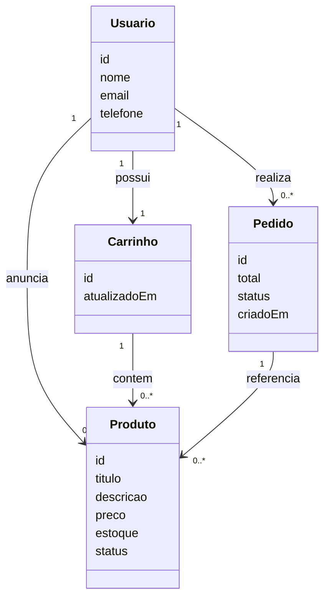

# techbazar

Marketplace simplificado para compra e venda de eletrônicos usados entre pessoas físicas. Permite cadastro de usuários, anúncio e listagem de produtos, carrinho e checkout enxuto.

> Projeto desenvolvido como Mini-Projeto Avaliativo do Módulo 1 — Semana 5, Aula 1 (Hands-on 1 — A Gênese), trilha "IA para DEVs" (SESI/SENAI-SC).

---

## Documentação do projeto

- **Arquitetura e stack:** [docs/ADR.md](docs/ADR.md) — decisão por Monólito Modular Java/Spring, alternativas consideradas e trade-offs.
- **Diagramas:** [docs/DIAGRAMAS.md](docs/DIAGRAMAS.md) — ER conceitual (Usuário, Produto, Pedido) e fluxo de busca/adição ao carrinho.
- **Mockup publicado:** https://edenilson-java.github.io/techbazar/ — visualização da Home Page funcionando no navegador.
- **Mockup da Home:** [index.html](index.html) — protótipo HTML + Tailwind via CDN.

---

## User Stories

> Formato: `Como [persona], quero [ação], para que [benefício]` + critérios de aceitação BDD (`Given/When/Then`).

### US-01 — Cadastro de usuário vendedor

**Como** um usuário não autenticado interessado em vender eletrônicos,
**quero** criar uma conta com e-mail, senha e dados de contato,
**para que** eu possa anunciar meus produtos no marketplace.

```gherkin
Cenário: Cadastro bem-sucedido com e-mail válido
  Given que estou na tela de cadastro
  And informo um e-mail ainda não cadastrado
  And informo uma senha com no mínimo 8 caracteres, 1 maiúscula e 1 número
  When confirmo o cadastro
  Then minha conta é criada com status "ativa"
  And recebo um e-mail de boas-vindas
  And sou redirecionado para a home autenticada

Cenário: Tentativa de cadastro com e-mail já existente
  Given que existe um usuário cadastrado com o e-mail "joao@email.com"
  When tento me cadastrar com o mesmo e-mail
  Then o sistema exibe a mensagem "E-mail já cadastrado"
  And nenhuma conta nova é criada

Cenário: Senha fraca rejeitada
  Given que estou na tela de cadastro
  When informo a senha "12345"
  Then o sistema exibe "Senha não atende aos requisitos mínimos"
  And o botão de confirmação permanece desabilitado
```

### US-02 — Busca e listagem de produtos

**Como** um comprador navegando no marketplace,
**quero** buscar produtos por palavra-chave e filtrar por categoria e faixa de preço,
**para que** eu encontre rapidamente o eletrônico que me interessa.

```gherkin
Cenário: Busca retorna resultados paginados
  Given que existem 50 produtos com a palavra "notebook" no título
  When busco por "notebook" na barra de busca
  Then o sistema retorna a primeira página com 20 resultados
  And exibe os controles de paginação (anterior/próxima)
  And ordena por relevância por padrão

Cenário: Filtro combinado de categoria e preço
  Given que estou na listagem de produtos
  When seleciono a categoria "Smartphones"
  And aplico o filtro de preço entre R$ 500 e R$ 1500
  Then somente produtos da categoria "Smartphones" com preço dentro da faixa são exibidos
  And o contador de resultados é atualizado

Cenário: Busca sem resultados
  Given que nenhum produto contém o termo "xpto123"
  When busco por "xpto123"
  Then o sistema exibe "Nenhum produto encontrado"
  And sugere termos populares de busca
```

### US-03 — Adicionar produto ao carrinho

**Como** um comprador autenticado,
**quero** adicionar produtos ao meu carrinho e ajustar quantidades,
**para que** eu possa revisar minha seleção antes de finalizar a compra.

```gherkin
Cenário: Adição de produto disponível
  Given que estou autenticado
  And visualizo um produto com estoque disponível
  When clico em "Adicionar ao carrinho"
  Then o produto é incluído no meu carrinho com quantidade 1
  And o ícone do carrinho exibe o contador atualizado
  And uma notificação confirma a ação

Cenário: Tentativa de adicionar produto esgotado
  Given que visualizo um produto com 0 unidades em estoque
  When clico em "Adicionar ao carrinho"
  Then o botão está desabilitado
  And o sistema exibe "Produto indisponível"

Cenário: Persistência do carrinho entre sessões
  Given que adicionei 2 itens ao carrinho
  When faço logout e volto a me autenticar em outro dispositivo
  Then meu carrinho mantém os 2 itens previamente adicionados
```

---

## Diagrama UML — Modelo de domínio (visão enxuta)

Vista simplificada das principais classes do domínio. O ER conceitual está em [docs/DIAGRAMAS.md](docs/DIAGRAMAS.md).


