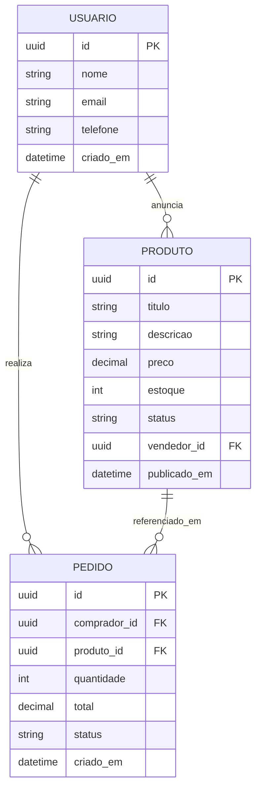
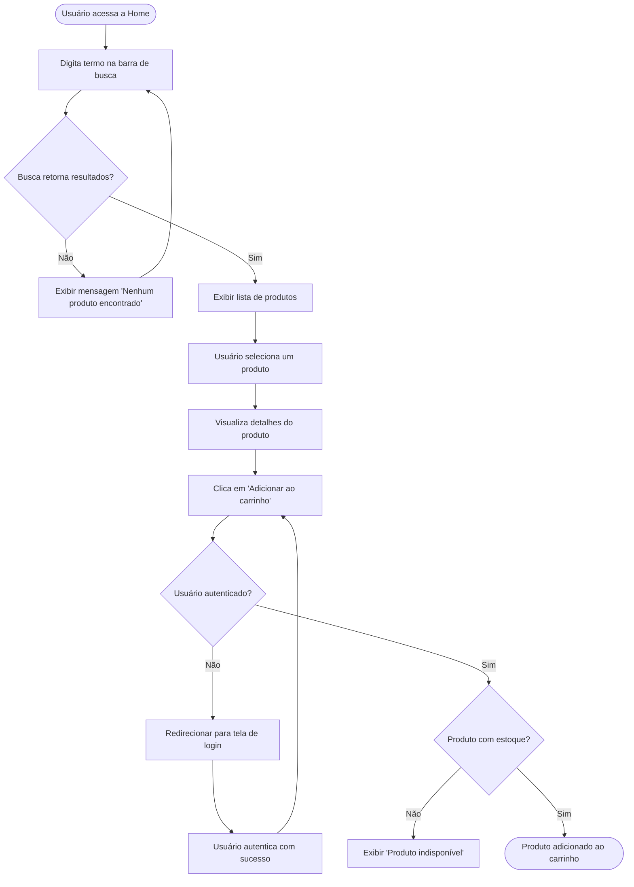

# Diagramas — techbazar

Diagramas conceituais simplificados produzidos no Hands-on 1 "A Gênese". O escopo é o do slide da aula: um diagrama Entidade-Relacionamento com as três entidades essenciais e um diagrama de fluxo cobrindo a jornada de busca e adição ao carrinho. Ambos são vistas conceituais simplificadas — não representam o modelo físico final do banco nem todas as classes do domínio.

---

## 1. Diagrama Entidade-Relacionamento (ER)

Modelo conceitual com as três entidades exigidas pelo Hands-on: **Usuário, Produto e Pedido**. Entidades auxiliares (Categoria, Carrinho, ItemCarrinho, ItemPedido, Pagamento, FotoProduto) ficam fora desta vista por escolha de escopo.

**Notas:**

- Um `USUARIO` pode anunciar zero ou mais `PRODUTO` (papel de vendedor) e realizar zero ou mais `PEDIDO` (papel de comprador). A mesma pessoa pode acumular os dois papéis.
- `PEDIDO` referencia diretamente `PRODUTO` nesta vista simplificada — no modelo detalhado da aplicação, essa relação passará por uma tabela `ItemPedido` para suportar múltiplos itens por pedido.

---

## 2. Diagrama de Fluxo — Busca e adição ao carrinho

Jornada do comprador desde a Home até o produto efetivamente adicionado ao carrinho. Cobre o caminho feliz e três desvios: busca sem resultados, usuário não autenticado e produto sem estoque.

**Pontos do fluxo:**

- O laço `D → B` permite ao usuário refinar o termo após uma busca vazia.
- Após o login bem-sucedido (`K`), o fluxo retorna ao ponto exato da ação que o exigiu (clicar em "Adicionar ao carrinho").
- "Produto indisponível" é um estado terminal nesta jornada — o usuário pode voltar à listagem por navegação, fora do escopo deste diagrama.
